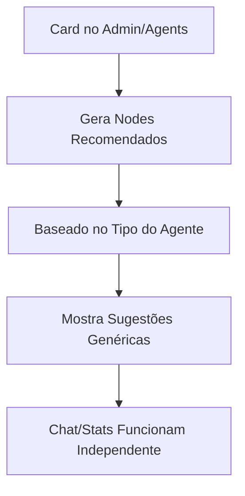
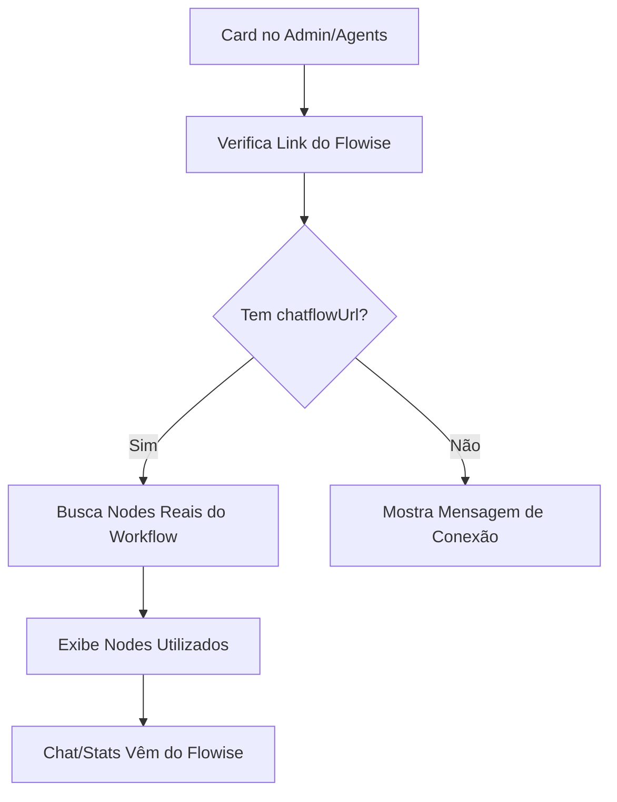

# 🎯 Chat com Contexto - Lógica Corrigida

## 📋 Problema Identificado

Os cards como "Chat com Contexto", "Especialista em Marketing Digital", "Analista de Negócios" estavam mostrando **"Nodes Recomendados"** baseados apenas no tipo do agente, quando deveriam mostrar **"Nodes do Workflow Real"** do Flowise.

## ✅ Solução Implementada

### **Antes (Lógica Incorreta):**


### **Depois (Lógica Correta):**


## 🔧 Mudanças Implementadas

### 1. **AgentCardWithFlowiseIntegration.tsx**
- ✅ Substituído `loadRecommendedNodes()` por `loadActualWorkflowNodes()`
- ✅ Nodes são carregados apenas se `isFlowiseConnected` e `flowiseChatflowId` existem
- ✅ Interface atualizada para mostrar status da conexão
- ✅ Título alterado de "Nodes Recomendados" para "Nodes do Workflow"

### 2. **Nova API: `/api/flowise-workflow/[id]/nodes`**
- ✅ Busca workflow real do Flowise via API
- ✅ Extrai nodes do `flowData` do workflow
- ✅ Categoriza nodes automaticamente
- ✅ Retorna dados estruturados dos nodes reais

### 3. **Interface de Estado**
- ✅ **Conectado**: Mostra nodes reais em verde
- ✅ **Desconectado**: Mostra mensagem e botão "Conectar ao Flowise"
- ✅ **Carregando**: Mostra estado de loading

## 🎯 Estados do Card

### **Estado 1: Agente Conectado ao Flowise**
```
┌─────────────────────────────────────┐
│ 🟢 Nodes do Workflow               │
│ Nodes utilizados no workflow       │
│                                     │
│ [LLM Model] [Chat Memory] [Vector]  │
│ +2 mais                             │
│                                     │
│ [Ver Nodes] [Configurar]            │
└─────────────────────────────────────┘
```

### **Estado 2: Agente Não Conectado**
```
┌─────────────────────────────────────┐
│ ⚠️ Agente Não Conectado             │
│ Precisa conectar ao Flowise         │
│                                     │
│ 🔴 Agente não conectado ao Flowise  │
│                                     │
│ [Conectar ao Flowise]               │
└─────────────────────────────────────┘
```

## 🌐 Configuração Necessária

### **Variáveis de Ambiente:**
```env
# URL do servidor Flowise
FLOWISE_URL=http://localhost:3000

# API Key do Flowise (opcional)
FLOWISE_API_KEY=your_api_key_here
```

### **Estrutura do Agente:**
```typescript
interface Agent {
  id: string;
  name: string; // ex: "Chat com Contexto"
  chatflowUrl?: string; // URL do chat do Flowise
  flowiseId?: string; // ID do workflow no Flowise
  // ...outros campos
}
```

## 🎯 Benefícios da Nova Lógica

1. **✅ Transparência**: Usuário vê exatamente quais nodes estão sendo usados
2. **✅ Precisão**: Dados vêm direto do Flowise, não de sugestões genéricas
3. **✅ Contexto Real**: Chat e estatísticas baseados no workflow real
4. **✅ Feedback Visual**: Status claro da conexão com Flowise
5. **✅ Workflow Completo**: Respeitando Studio → Admin/Agents → Flowise

## 🚀 Próximos Passos

1. **Testar a integração** com um workflow real do Flowise
2. **Configurar variáveis de ambiente** para conectar ao Flowise
3. **Validar que o chat funciona** apenas após conexão estabelecida
4. **Implementar analytics reais** do Flowise em vez de dados mock

## 📊 Exemplo de Resposta da API

```json
{
  "success": true,
  "chatflowId": "abc-123-def",
  "workflowName": "Chat com Contexto - Marketing",
  "nodes": [
    {
      "id": "node-1",
      "label": "GLM-4 Chat Model",
      "type": "ChatOpenAI",
      "category": "LLM",
      "description": "Modelo de linguagem para geração de respostas"
    },
    {
      "id": "node-2", 
      "label": "Buffer Memory",
      "type": "BufferMemory",
      "category": "Memory",
      "description": "Gerenciamento de memória da conversa"
    }
  ],
  "metadata": {
    "nodeCount": 2,
    "workflowId": "abc-123-def",
    "category": "Chat",
    "lastModified": "2024-01-15T10:30:00Z"
  }
}
```

---

**Resultado**: Agora os cards mostram dados reais do Flowise em vez de sugestões genéricas! 🎉