# 🔄 Integração Bidirecional ZANAI ↔ Flowise

## 🎯 Visão Geral

Implementação de comunicação bidirecional completa entre ZANAI e Flowise, onde:

1. **ZANAI → Flowise**: Exporta agentes e configurações para o Flowise
2. **Flowise → ZANAI**: Retorna estatísticas, resultados e funcionalidades via API de chat

## 🏗️ Arquitetura da Integração

```mermaid
graph TD
    A[ZANAI AI Agent Cards] <--> B[API de Integração]
    B <--> C[Flowise Chat API]
    C <--> D[Flowise AgentFlows]
    
    E[ZANAI Database] <--> B
    F[Flowise Database] <--> C
    
    G[Estatísticas] <--> B
    H[Resultados] <--> B
    I[Funcionalidades] <--> B
```



## 📋 Componentes da Integração

### 1. Exportador de Agentes para Flowise
- Converte AI Agent Cards em nós Flowise
- Mapeia ações específicas para ferramentas Flowise
- Cria chatflows completos no Flowise

### 2. Coletor de Estatísticas do Flowise
- Monitora execuções via API de chat
- Coleta métricas de performance
- Registra resultados em tempo real

### 3. Processador de Resultados
- Interpreta respostas da API de chat
- Extrai dados estruturados
- Atualiza interface do ZANAI

## 🔧 Implementação

### 1. Configuração do Ambiente

```typescript
// src/lib/flowise-config.ts
export const FLOWISE_CONFIG = {
  baseUrl: 'https://aaranha-zania.hf.space',
  apiKey: 'wNFL5HJcOA3RwJdKiVTUWqdzigK7OCUwRKo9KEgjenw',
  chatEndpoint: '/api/v1/chatflows',
  executionEndpoint: '/api/v1/chatflows/{id}/execution',
  statsEndpoint: '/api/v1/chatflows/{id}/stats'
};
```

### 2. Exportador de Agentes

```typescript
// src/lib/flowise-exporter.ts
export class FlowiseExporter {
  async exportAgentToFlowise(agent: Agent) {
    // Converte agente ZANAI para nó Flowise
    const flowiseNode = this.convertToFlowiseNode(agent);
    
    // Cria chatflow no Flowise
    const chatflow = await this.createChatflow({
      name: agent.name,
      description: agent.description,
      nodes: [flowiseNode],
      edges: []
    });
    
    // Salva referência no banco ZANAI
    await this.saveFlowiseReference(agent.id, chatflow.id);
    
    return chatflow;
  }
  
  private convertToFlowiseNode(agent: Agent) {
    // Mapeia ações do agente para ferramentas Flowise
    const tools = agent.actions.map(action => ({
      type: 'http',
      config: {
        method: 'POST',
        url: `${process.env.NEXT_PUBLIC_APP_URL}/api/card/execute`,
        headers: {
          'Content-Type': 'application/json'
        },
        body: {
          agentId: agent.id,
          action: action.id,
          input: '${input}'
        }
      }
    }));
    
    return {
      id: `agent-${agent.id}`,
      type: 'agent',
      position: { x: 100, y: 100 },
      data: {
        label: agent.name,
        tools,
        systemMessage: agent.config
      }
    };
  }
}
```

### 3. Coletor de Estatísticas

```typescript
// src/lib/flowise-stats-collector.ts
export class FlowiseStatsCollector {
  async collectAgentStats(agentId: string, flowiseChatflowId: string) {
    try {
      // Busca estatísticas via API de chat
      const stats = await this.fetchChatflowStats(flowiseChatflowId);
      
      // Coleta dados de execuções recentes
      const executions = await this.fetchRecentExecutions(flowiseChatflowId);
      
      // Processa e formata os dados
      const processedStats = this.processStatsData(stats, executions);
      
      // Salva no banco ZANAI
      await this.saveAgentStats(agentId, processedStats);
      
      return processedStats;
    } catch (error) {
      console.error('Erro ao coletar estatísticas:', error);
      return null;
    }
  }
  
  private async fetchChatflowStats(chatflowId: string) {
    const response = await fetch(`${FLOWISE_CONFIG.baseUrl}/api/v1/chatflows/${chatflowId}/stats`, {
      headers: {
        'Authorization': `Bearer ${FLOWISE_CONFIG.apiKey}`
      }
    });
    
    return response.json();
  }
  
  private async fetchRecentExecutions(chatflowId: string) {
    const response = await fetch(`${FLOWISE_CONFIG.baseUrl}/api/v1/chatflows/${chatflowId}/executions`, {
      headers: {
        'Authorization': `Bearer ${FLOWISE_CONFIG.apiKey}`
      }
    });
    
    return response.json();
  }
  
  private processStatsData(stats: any, executions: any[]) {
    return {
      totalExecutions: executions.length,
      successRate: this.calculateSuccessRate(executions),
      averageResponseTime: this.calculateAverageResponseTime(executions),
      mostUsedActions: this.getMostUsedActions(executions),
      lastExecution: executions[0]?.createdAt || null,
      performanceMetrics: {
        throughput: stats.throughput || 0,
        errorRate: stats.errorRate || 0,
        uptime: stats.uptime || 100
      },
      userFeedback: {
        satisfaction: stats.satisfaction || 0,
        ratings: stats.ratings || []
      }
    };
  }
}
```

### 4. API de Chat Bidirecional

```typescript
// src/app/api/flowise/chat/route.ts
export async function POST(request: Request) {
  try {
    const { agentId, message, flowiseChatflowId } = await request.json();
    
    // Envia mensagem para o Flowise
    const flowiseResponse = await sendToFlowise(flowiseChatflowId, message);
    
    // Processa resposta do Flowise
    const processedResponse = await processFlowiseResponse(flowiseResponse);
    
    // Coleta estatísticas
    await collectAndUpdateStats(agentId, flowiseChatflowId);
    
    // Retorna resposta formatada para o cliente
    return Response.json({
      success: true,
      response: processedResponse,
      stats: await getLatestAgentStats(agentId),
      timestamp: new Date().toISOString()
    });
    
  } catch (error) {
    console.error('Erro na API de chat bidirecional:', error);
    return Response.json({
      success: false,
      error: error.message
    }, { status: 500 });
  }
}

async function sendToFlowise(chatflowId: string, message: string) {
  const response = await fetch(`${FLOWISE_CONFIG.baseUrl}/api/v1/chatflows/${chatflowId}/execution`, {
    method: 'POST',
    headers: {
      'Content-Type': 'application/json',
      'Authorization': `Bearer ${FLOWISE_CONFIG.apiKey}`
    },
    body: JSON.stringify({
      question: message,
      overrideConfig: {
        sessionId: generateSessionId()
      }
    })
  });
  
  return response.json();
}

async function processFlowiseResponse(flowiseResponse: any) {
  // Extrai dados estruturados da resposta
  const { text, data, metadata } = flowiseResponse;
  
  // Identifica tipo de resposta
  const responseType = identifyResponseType(text);
  
  // Formata resposta para o cliente
  return {
    type: responseType,
    content: text,
    data: data || {},
    metadata: {
      ...metadata,
      processedAt: new Date().toISOString(),
      confidence: calculateConfidence(text)
    }
  };
}
```

### 5. Interface do Cliente com Estatísticas

```typescript
// src/components/AgentCardWithStats.tsx
interface AgentCardWithStatsProps {
  agent: Agent;
  flowiseChatflowId?: string;
}

export function AgentCardWithStats({ agent, flowiseChatflowId }: AgentCardWithStatsProps) {
  const [stats, setStats] = useState<AgentStats | null>(null);
  const [isLoading, setIsLoading] = useState(false);
  
  useEffect(() => {
    if (flowiseChatflowId) {
      loadAgentStats();
    }
  }, [flowiseChatflowId]);
  
  const loadAgentStats = async () => {
    setIsLoading(true);
    try {
      const response = await fetch(`/api/agents/${agent.id}/stats`);
      const data = await response.json();
      setStats(data);
    } catch (error) {
      console.error('Erro ao carregar estatísticas:', error);
    } finally {
      setIsLoading(false);
    }
  };
  
  const executeAction = async (actionId: string) => {
    try {
      // Executa ação via API do ZANAI
      const response = await fetch('/api/card/execute', {
        method: 'POST',
        headers: { 'Content-Type': 'application/json' },
        body: JSON.stringify({
          agentId: agent.id,
          action: actionId,
          input: 'Executar ação'
        })
      });
      
      // Atualiza estatísticas após execução
      if (flowiseChatflowId) {
        await loadAgentStats();
      }
      
      return response.json();
    } catch (error) {
      console.error('Erro ao executar ação:', error);
    }
  };
  
  return (
    <Card className="w-full">
      <CardHeader>
        <CardTitle className="flex items-center justify-between">
          <span>{agent.name}</span>
          {flowiseChatflowId && (
            <Badge variant="secondary">Flowise Connected</Badge>
          )}
        </CardTitle>
        <CardDescription>{agent.description}</CardDescription>
      </CardHeader>
      
      <CardContent>
        {/* Estatísticas do Flowise */}
        {stats && (
          <div className="mb-4 p-3 bg-gray-50 rounded-lg">
            <h4 className="font-semibold mb-2">Estatísticas do Flowise</h4>
            <div className="grid grid-cols-2 gap-2 text-sm">
              <div>
                <span className="font-medium">Execuções:</span> {stats.totalExecutions}
              </div>
              <div>
                <span className="font-medium">Taxa de Sucesso:</span> {stats.successRate}%
              </div>
              <div>
                <span className="font-medium">Tempo Médio:</span> {stats.averageResponseTime}ms
              </div>
              <div>
                <span className="font-medium">Última Execução:</span> {stats.lastExecution}
              </div>
            </div>
          </div>
        )}
        
        {/* Ações do Agente */}
        <div className="grid grid-cols-2 gap-2">
          {agent.actions.map((action) => (
            <Button
              key={action.id}
              variant="outline"
              size="sm"
              onClick={() => executeAction(action.id)}
              disabled={isLoading}
            >
              {action.name}
            </Button>
          ))}
        </div>
        
        {/* Chat Interface */}
        {flowiseChatflowId && (
          <div className="mt-4">
            <ChatInterface
              agentId={agent.id}
              flowiseChatflowId={flowiseChatflowId}
              onMessageSent={loadAgentStats}
            />
          </div>
        )}
      </CardContent>
    </Card>
  );
}
```

### 6. Interface de Chat com Flowise

```typescript
// src/components/ChatInterface.tsx
interface ChatInterfaceProps {
  agentId: string;
  flowiseChatflowId: string;
  onMessageSent: () => void;
}

export function ChatInterface({ agentId, flowiseChatflowId, onMessageSent }: ChatInterfaceProps) {
  const [messages, setMessages] = useState<ChatMessage[]>([]);
  const [input, setInput] = useState('');
  const [isLoading, setIsLoading] = useState(false);
  
  const sendMessage = async () => {
    if (!input.trim()) return;
    
    setIsLoading(true);
    try {
      const response = await fetch('/api/flowise/chat', {
        method: 'POST',
        headers: { 'Content-Type': 'application/json' },
        body: JSON.stringify({
          agentId,
          message: input,
          flowiseChatflowId
        })
      });
      
      const data = await response.json();
      
      if (data.success) {
        setMessages(prev => [
          ...prev,
          { role: 'user', content: input, timestamp: new Date() },
          { role: 'assistant', content: data.response.content, timestamp: new Date() }
        ]);
        
        // Notifica componente pai para atualizar estatísticas
        onMessageSent();
      }
      
      setInput('');
    } catch (error) {
      console.error('Erro ao enviar mensagem:', error);
    } finally {
      setIsLoading(false);
    }
  };
  
  return (
    <div className="border rounded-lg p-3">
      <div className="h-48 overflow-y-auto mb-3 space-y-2">
        {messages.map((message, index) => (
          <div
            key={index}
            className={`p-2 rounded ${
              message.role === 'user' 
                ? 'bg-blue-100 ml-8' 
                : 'bg-gray-100 mr-8'
            }`}
          >
            <div className="text-sm">{message.content}</div>
            <div className="text-xs text-gray-500 mt-1">
              {message.timestamp.toLocaleTimeString()}
            </div>
          </div>
        ))}
      </div>
      
      <div className="flex gap-2">
        <Input
          value={input}
          onChange={(e) => setInput(e.target.value)}
          placeholder="Digite sua mensagem..."
          onKeyPress={(e) => e.key === 'Enter' && sendMessage()}
        />
        <Button onClick={sendMessage} disabled={isLoading}>
          {isLoading ? '...' : 'Enviar'}
        </Button>
      </div>
    </div>
  );
}
```

## 📊 Fluxo de Dados Bidirecional

### 1. Exportação de Agentes
```
ZANAI Agent → Flowise Exporter → Flowise API → Chatflow Criado → ID Retornado
```

### 2. Execução de Ações
```
Usuário clica → ZANAI API → Flowise Chat API → Processamento → Resultado → Estatísticas Atualizadas
```

### 3. Coleta de Estatísticas
```
Flowise Stats API → Stats Collector → Processamento → Banco ZANAI → Interface Atualizada
```

### 4. Chat Bidirecional
```
Usuário digita → ZANAI Chat API → Flowise Chat API → Resposta → Processamento → Cliente
```

## 🚀 Benefícios da Integração

### 1. **Para o Cliente**
- Interface familiar com AI Agent Cards
- Acesso a estatísticas em tempo real
- Chat natural com agentes especializados
- Resultados mensuráveis e rastreáveis

### 2. **Para o Sistema**
- Aproveitamento do ecossistema Flowise
- Escalabilidade horizontal
- Monitoramento centralizado
- Analytics avançados

### 3. **Para os Desenvolvedores**
- API unificada e consistente
- Ferramentas de debugging
- Logs detalhados
- Testes automatizados

## 📈 Métricas Monitoradas

### 1. **Performance**
- Tempo de resposta médio
- Taxa de sucesso
- Throughput
- Latência

### 2. **Uso**
- Número de execuções
- Ações mais utilizadas
- Picos de uso
- Sessões ativas

### 3. **Qualidade**
- Satisfação do usuário
- Taxa de erro
- Feedback qualitativo
- Melhorias sugeridas

## 🔮 Próximos Passos

1. **Implementar exportador de agentes**
2. **Criar coletor de estatísticas**
3. **Desenvolver interface de chat**
4. **Testar integração completa**
5. **Documentar APIs**
6. **Deploy em produção**

---

Esta implementação cria uma **ponte robusta e bidirecional** entre o ZANAI e o Flowise, permitindo que os clientes tenham o melhor dos dois mundos: a simplicidade dos AI Agent Cards e o poder do ecossistema Flowise.