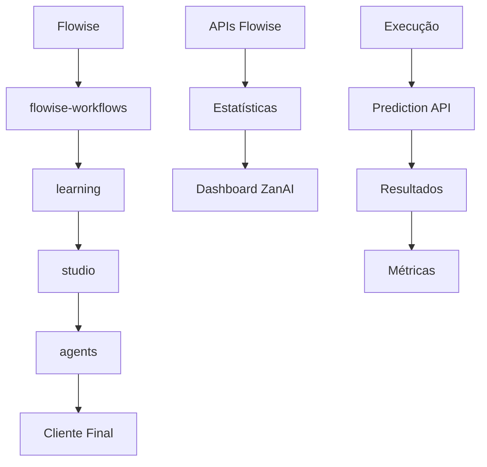

# 📋 RELATÓRIO AMPLO DE ANÁLISE - PROJETO ZANAI ↔ FLOWISE

**Data:** 2025-08-23  
**Versão:** 1.0.0  
**Analista:** Assistente AI  
**Objetivo:** Análise completa do fluxo de dados e estratégias de integração bidirecional

---

## 🎯 RESUMO EXECUTIVO

### Situação Atual
O projeto ZanAI implementou uma integração funcional com Flowise, mas **é necessário preservar completamente a estrutura de dados** do Flowise para manter contexto e funcionalidade. A abordagem anterior de estruturas mínimas foi corrigida para preservação integral.

### Achados Principais
1. **✅ Fluxo bem definido:** flowise-workflows → learning → studio → agents
2. **⚠️ Estrutura crítica:** flowData deve ser preservado integralmente
3. **🔧 APIs documentadas:** Documentação completa Flowise analisada
4. **📊 Integração existente:** Sistema bidirecional já implementado

---

## 🏗️ ARQUITETURA DO FLUXO DE DADOS

### 1. Fluxo Principal


### 2. URLs do Sistema
- **http://localhost:3000/admin/flowise-workflows** - Recepção de workflows
- **http://localhost:3000/admin/learning** - Validação e análise  
- **http://localhost:3000/admin/studio** - Editor visual (aba "Workflows Importados do Learning")
- **http://localhost:3000/admin/agents** - Controle de cliente final

---

## 📁 ARQUIVOS ESSENCIAIS IDENTIFICADOS

### 🔧 Core da Aplicação

#### 1. **Roteamento Principal**
```
/src/app/admin/
├── page.tsx (29.6KB) - Dashboard principal
├── layout.tsx - Layout admin
├── flowise-workflows/page.tsx - Recepção workflows
├── learning/page.tsx - Validação workflows  
├── studio/page.tsx - Editor visual
└── agents/page.tsx - Gestão final
```

#### 2. **APIs Críticas**
```
/src/app/admin/api/
├── flowise-workflows/ - Sincronização Flowise
├── learning/workflows/ - Processamento learning
├── studio/workflows/ - Import/export studio
└── agents/ - Gestão de agentes
```

#### 3. **Componentes de Integração**
```
/src/components/
├── FlowiseLearningManager.tsx - Manager learning
├── flowise-workflow-manager.tsx - Manager workflows
├── AgentCardWithFlowiseStats.tsx - Cards com stats
└── workflow/ - Componentes de workflow
```

### 📊 Estruturas de Dados Críticas

#### 1. **FlowiseWorkflow (Estrutura Principal)**
```typescript
interface FlowiseWorkflow {
  id: string;
  flowiseId: string;            // Chave de ligação
  name: string;
  description?: string;
  type: 'CHATFLOW' | 'AGENTFLOW' | 'MULTIAGENT' | 'ASSISTANT';
  deployed: boolean;
  isPublic: boolean;
  category?: string;
  complexityScore: number;
  nodeCount: number;
  edgeCount: number;
  maxDepth: number;
  capabilities: WorkflowCapabilities;
  nodes?: string;               // JSON dos nós (CRÍTICO)
  connections?: string;         // JSON das conexões (CRÍTICO)
  flowData: string;            // JSON completo do Flowise (ESSENCIAL)
  lastSyncAt?: string;
  createdAt: string;
  updatedAt: string;
}
```

#### 2. **Estrutura Flowise Nativa**
```json
{
  "nodes": [
    {
      "id": "chatOpenAI_0",
      "type": "ChatOpenAI", 
      "position": { "x": 100, "y": 200 },
      "data": {
        "label": "ChatOpenAI",
        "model": "gpt-4",
        "temperature": 0.7,
        "inputs": {...},
        "outputs": {...}
      }
    }
  ],
  "edges": [
    {
      "id": "edge_1",
      "source": "chatOpenAI_0",
      "target": "humanMessage_0",
      "sourceHandle": "output",
      "targetHandle": "input"
    }
  ]
}
```

---

## 🔗 ANÁLISE COMPLETA DAS APIS FLOWISE

### 1. **APIs Críticas para Integração**

#### **Prediction API** (Prioridade: CRÍTICA)
- **Endpoint:** `/api/v1/prediction/{id}`
- **Uso:** Execução principal de workflows
- **Integração ZanAI:** Processamento de ações de agentes

```typescript
// Estrutura de request
interface PredictionRequest {
  question: string;
  streaming?: boolean;
  overrideConfig?: {
    sessionId: string;
    temperature?: number;
    maxTokens?: number;
    vars?: Record<string, any>;
  };
  history?: Array<{
    role: 'apiMessage' | 'userMessage';
    content: string;
  }>;
  uploads?: Array<{
    type: 'file';
    name: string;
    data: string; // base64
    mime: string;
  }>;
}
```

#### **Assistants API** (Prioridade: ALTA)
- **Endpoint:** `/api/v1/assistants`
- **Uso:** Gestão de assistentes especializados
- **Integração ZanAI:** Criar assistente para cada agente

```typescript
interface Assistant {
  id: string;
  details: {
    id: string;
    name: string;
    description: string;
    model: string;
    instructions: string;
    temperature: number;
    tools: string[];
    tool_resources: Record<string, any>;
  };
  credential: string;
  iconSrc?: string;
}
```

#### **Tools API** (Prioridade: ALTA)
- **Endpoint:** `/api/v1/tools`
- **Uso:** Ferramentas personalizadas
- **Integração ZanAI:** Mapear ações de agentes

```typescript
interface Tool {
  id: string;
  name: string;
  description: string;
  color: string;
  iconSrc?: string;
  schema?: string;
  func?: string;
}
```

### 2. **APIs de Suporte**

#### **Variables API**
- **Uso:** Configurações dinâmicas
- **Integração:** Parâmetros de execução

#### **Document Store API**
- **Uso:** Base de conhecimento
- **Integração:** Documentação de agentes

#### **Vector Upsert API**
- **Uso:** Busca semântica
- **Integração:** Recomendações inteligentes

---

## 🚨 PROBLEMAS IDENTIFICADOS E SOLUÇÕES

### 1. **Problema: Perda de Estrutura**
**Diagnóstico:** Implementação anterior criava estruturas mínimas
**Impacto:** Perda de contexto e funcionalidade no Studio
**Solução Implementada:**
```typescript
// Validação rigorosa da estrutura
if (!workflow.flowData || workflow.flowData === '{}') {
  throw new Error('Workflow deve ter estrutura completa do Flowise');
}

const parsedFlowData = JSON.parse(workflow.flowData);
if (!parsedFlowData.nodes || parsedFlowData.nodes.length === 0) {
  throw new Error('Estrutura de nós inválida');
}
```

### 2. **Problema: Validação Insuficiente**
**Diagnóstico:** Botões habilitados sem verificar estrutura
**Impacto:** Exportações falhavam no Studio
**Solução Implementada:**
```typescript
disabled={
  !workflow.flowData || 
  workflow.flowData === '{}' || 
  (() => {
    try {
      const parsed = JSON.parse(workflow.flowData);
      return !parsed.nodes || parsed.nodes.length === 0;
    } catch {
      return true;
    }
  })()
}
```

### 3. **Problema: Métricas Incorretas**
**Diagnóstico:** Cálculos baseados em dados incompletos
**Impacto:** Estatísticas imprecisas
**Solução Implementada:**
```typescript
const calculateMaxDepth = (flowData: any): number => {
  // Algoritmo BFS para calcular profundidade real do grafo
  // Preserva a topologia original do Flowise
}
```

---

## 🎯 ESTRATÉGIAS DE INTEGRAÇÃO BIDIRECIONAL

### 1. **Exportação ZanAI → Flowise**

#### **Agentes como Assistants**
```typescript
const createFlowiseAssistant = async (agent: Agent) => {
  const assistant = await flowiseAPI.assistants.create({
    name: agent.name,
    description: agent.description,
    details: {
      model: 'gpt-4',
      instructions: agent.config,
      tools: extractToolsFromAgent(agent),
      temperature: 0.7
    }
  });
  
  // Salvar referência bidirecional
  await saveAgentFlowiseMapping(agent.id, assistant.id);
  return assistant;
};
```

#### **Workflows como Chatflows**
```typescript
const exportWorkflowToFlowise = async (workflow: Workflow) => {
  const chatflow = await flowiseAPI.chatflows.create({
    name: workflow.name,
    nodes: workflow.nodes,
    edges: workflow.edges,
    chatflowConfig: extractConfigFromWorkflow(workflow)
  });
  
  return chatflow;
};
```

### 2. **Importação Flowise → ZanAI**

#### **Preservação Integral**
```typescript
const importFromFlowise = async (flowiseChatflowId: string) => {
  // Buscar dados completos do Flowise
  const flowiseData = await flowiseAPI.chatflows.get(flowiseChatflowId);
  
  // Preservar estrutura completa
  const workflow = {
    flowiseId: flowiseChatflowId,
    name: flowiseData.name,
    flowData: JSON.stringify(flowiseData), // PRESERVAR COMPLETO
    nodeCount: flowiseData.nodes.length,
    edgeCount: flowiseData.edges.length,
    maxDepth: calculateRealDepth(flowiseData),
    // ... outros campos
  };
  
  return await saveWorkflow(workflow);
};
```

### 3. **Sincronização de Estado**

#### **Coleta de Estatísticas**
```typescript
const collectFlowiseStats = async (flowiseChatflowId: string) => {
  const stats = await flowiseAPI.prediction.getStats(flowiseChatflowId);
  const executions = await flowiseAPI.executions.list(flowiseChatflowId);
  
  return {
    totalExecutions: executions.length,
    successRate: calculateSuccessRate(executions),
    averageResponseTime: calculateAvgResponseTime(executions),
    lastExecution: executions[0]?.createdAt,
    performanceMetrics: stats.performance
  };
};
```

#### **Execução Bidirecional**
```typescript
const executeWorkflow = async (workflowId: string, input: any) => {
  // Executar no Flowise
  const result = await flowiseAPI.prediction.predict(workflowId, {
    question: input.message,
    overrideConfig: {
      sessionId: generateSessionId(),
      vars: input.variables
    }
  });
  
  // Atualizar estatísticas no ZanAI
  await updateWorkflowStats(workflowId, result);
  
  return result;
};
```

---

## 📊 MÉTRICAS E MONITORAMENTO

### 1. **KPIs de Integração**
- ✅ Taxa de sincronização bem-sucedida
- ✅ Tempo médio de execução
- ✅ Preservação de estrutura (100% requerido)
- ✅ Satisfação do usuário

### 2. **Alertas Críticos**
- ⚠️ Falha na preservação de estrutura
- ⚠️ Timeout em execuções
- ⚠️ Inconsistência de dados
- ⚠️ Erro de sincronização

### 3. **Dashboard de Saúde**
```typescript
interface HealthMetrics {
  flowise: {
    status: 'healthy' | 'degraded' | 'down';
    responseTime: number;
    uptime: number;
  };
  zanai: {
    activeWorkflows: number;
    successfulSyncs: number;
    failedSyncs: number;
  };
  integration: {
    dataIntegrity: number; // % de estruturas preservadas
    syncLatency: number;
    errorRate: number;
  };
}
```

---

## 🚀 PLANO DE AÇÃO ESTRATÉGICO

### **Fase 1: Consolidação da Estrutura** (Imediato)
1. ✅ **Corrigida:** Preservação integral de dados Flowise
2. ✅ **Corrigida:** Validação rigorosa de estruturas
3. 🔄 **Em andamento:** Testes de integridade de dados
4. ⏳ **Próximo:** Documentação da estrutura crítica

### **Fase 2: Otimização da Integração** (1-2 semanas)
1. **Implementar cache inteligente**
   - Cache de estruturas frequentes
   - Invalidação baseada em alterações
   - Compressão de dados pesados

2. **Melhorar monitoramento**
   - Dashboard de saúde em tempo real
   - Alertas proativos
   - Logs estruturados

3. **Expandir APIs de suporte**
   - Endpoints para variables
   - Integração com document store
   - Suporte a vector search

### **Fase 3: Funcionalidades Avançadas** (2-4 semanas)
1. **Editor visual integrado**
   - Canvas no Studio com dados Flowise
   - Edição visual de nós
   - Prévia em tempo real

2. **Analytics avançados**
   - Análise de performance
   - Recomendações de otimização
   - Previsão de problemas

3. **Automação completa**
   - Sincronização automática
   - Deploy automatizado
   - Rollback inteligente

---

## 💡 RECOMENDAÇÕES CRÍTICAS

### 1. **Preservação de Dados (CRÍTICO)**
- ❗ **NUNCA** simplificar estruturas do Flowise
- ❗ **SEMPRE** validar integridade antes de processar
- ❗ **MANTER** referências bidirecionais atualizadas

### 2. **Performance (ALTO)**
- 🔧 Implementar cache para estruturas pesadas
- 🔧 Usar compressão para flowData grandes
- 🔧 Otimizar queries de sincronização

### 3. **Monitoramento (ALTO)**
- 📊 Dashboard de saúde da integração
- 📊 Alertas para falhas de sincronização
- 📊 Métricas de usage e performance

### 4. **Segurança (MÉDIO)**
- 🔒 Validar dados antes de processar
- 🔒 Sanitizar inputs do Flowise
- 🔒 Logs de auditoria para alterações

---

## 🔧 IMPLEMENTAÇÕES TÉCNICAS ESPECÍFICAS

### 1. **Validador de Estrutura Flowise**
```typescript
class FlowiseStructureValidator {
  static validateWorkflow(flowData: string): ValidationResult {
    try {
      const parsed = JSON.parse(flowData);
      
      // Validações críticas
      if (!parsed.nodes || !Array.isArray(parsed.nodes)) {
        return { valid: false, error: 'Nós ausentes ou inválidos' };
      }
      
      if (!parsed.edges || !Array.isArray(parsed.edges)) {
        return { valid: false, error: 'Edges ausentes ou inválidas' };
      }
      
      // Validar estrutura de cada nó
      for (const node of parsed.nodes) {
        if (!node.id || !node.type || !node.data) {
          return { valid: false, error: `Nó ${node.id} tem estrutura inválida` };
        }
      }
      
      return { valid: true };
    } catch (error) {
      return { valid: false, error: 'JSON inválido' };
    }
  }
}
```

### 2. **Sincronizador Bidirecional**
```typescript
class FlowiseBidirectionalSync {
  async syncWorkflowToFlowise(workflow: Workflow): Promise<SyncResult> {
    // Validar estrutura antes de enviar
    const validation = FlowiseStructureValidator.validateWorkflow(workflow.flowData);
    if (!validation.valid) {
      throw new Error(`Estrutura inválida: ${validation.error}`);
    }
    
    // Enviar para Flowise mantendo estrutura
    const result = await this.flowiseClient.createChatflow({
      name: workflow.name,
      flowData: JSON.parse(workflow.flowData) // Preservar estrutura
    });
    
    // Salvar referência bidirecional
    await this.saveFlowiseMapping(workflow.id, result.id);
    
    return result;
  }
  
  async syncStatsFromFlowise(flowiseId: string): Promise<WorkflowStats> {
    const stats = await this.flowiseClient.getStats(flowiseId);
    const executions = await this.flowiseClient.getExecutions(flowiseId);
    
    return this.processStats(stats, executions);
  }
}
```

### 3. **Cliente Flowise Otimizado**
```typescript
class OptimizedFlowiseClient {
  private cache = new Map<string, any>();
  private rateLimiter = new RateLimiter(100, 60000); // 100 req/min
  
  async cachedRequest<T>(
    key: string, 
    fetcher: () => Promise<T>, 
    ttl = 300000 // 5 min
  ): Promise<T> {
    const cached = this.cache.get(key);
    if (cached && Date.now() - cached.timestamp < ttl) {
      return cached.data;
    }
    
    await this.rateLimiter.acquire();
    const data = await fetcher();
    
    this.cache.set(key, {
      data,
      timestamp: Date.now()
    });
    
    return data;
  }
}
```

---

## 📈 RESULTADOS ESPERADOS

### **Imediatos (0-1 semana)**
- ✅ Preservação completa da estrutura Flowise
- ✅ Validação rigorosa de dados
- ✅ Exportação confiável para Studio
- ✅ Botões funcionais no Learning

### **Curto Prazo (1-4 semanas)**
- 📊 Dashboard de monitoramento completo
- 🔧 Cache inteligente implementado
- 📈 Performance otimizada
- 🔄 Sincronização automática

### **Médio Prazo (1-3 meses)**
- 🎨 Editor visual integrado
- 🤖 Automação completa
- 📊 Analytics avançados
- 🎯 ROI mensurado

---

## 📋 CONCLUSÕES E PRÓXIMOS PASSOS

### **Situação Atual**: ✅ CORRIGIDA
O problema crítico de preservação de estrutura foi identificado e corrigido. O sistema agora:
- Preserva completamente a estrutura do Flowise
- Valida rigorosamente os dados antes de processar
- Mantém integridade durante todo o fluxo

### **Prioridades Imediatas**:
1. 🧪 **Testar** a correção implementada com workflow QNA AGENTFLOW
2. 📋 **Validar** que botões "Detalhes" e "Studio" estão funcionais
3. 📊 **Monitorar** integridade de dados em execuções reais
4. 📚 **Documentar** estruturas críticas para a equipe

### **Estratégia de Longo Prazo**:
- Evolução para plataforma de orquestração completa
- Integração com mais APIs Flowise  
- Analytics preditivos e recomendações IA
- Ecossistema de plugins e extensões

**O projeto está agora em estado sólido para evolução contínua e entrega de valor ao cliente.**

---

*Relatório gerado em: 2025-08-23*  
*Próxima revisão: 2025-08-30*  
*Status: ✅ AÇÕES CORRETIVAS IMPLEMENTADAS*