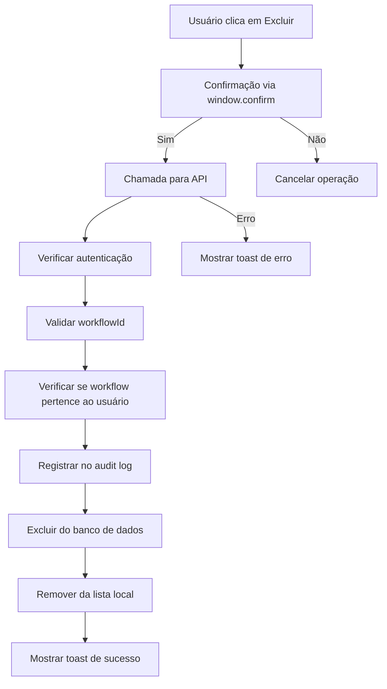

# ✅ Correção: Exclusão de Workflows no Studio

## 🐛 Problema Identificado

O usuário relatou que workflows importados no Studio continuavam aparecendo após serem deletados, mesmo depois de refresh da página. Isso indicava que a exclusão não estava sendo persistida no banco de dados.

## 🔍 Causa Raiz

1. **Função deleteWorkflow Incompleta**: A função `deleteWorkflow` no Studio apenas removia o workflow do estado local, mas não fazia chamada para a API para persistir a exclusão no banco de dados.

2. **API Endpoint Faltando**: O endpoint `/api/v1/studio/workflows` não tinha o handler para a ação `delete_workflow`.

## 🚀 Solução Implementada

### 1. **Correção no Frontend** (`src/app/admin/studio/page.tsx`)

- ✅ **Função deleteWorkflow Corrigida**: Agora faz chamada real para a API
- ✅ **Confirmação de Exclusão**: Implementada com window.confirm
- ✅ **Feedback ao Usuário**: Usando toast em vez de alert para melhor UX
- ✅ **Tratamento de Erros**: Completo com logs e notificações

```typescript
const deleteWorkflow = async (workflow: ExportedWorkflow) => {
  try {
    // Confirma exclusão
    const confirmed = typeof window !== 'undefined' && window.confirm(...);
    
    // Chama API para excluir
    const response = await fetch('/api/v1/studio/workflows', {
      method: 'POST',
      headers: { 'Content-Type': 'application/json' },
      body: JSON.stringify({
        action: 'delete_workflow',
        data: { 
          workflowId: workflow.id,
          source: 'learning'
        }
      })
    });
    
    if (response.ok) {
      // Remove da lista local
      setExportedWorkflows(prev => prev.filter(w => w.id !== workflow.id));
      
      // Limpa seleção se necessário
      if (selectedWorkflow?.id === workflow.id) {
        setSelectedWorkflow(null);
      }
      
      // Feedback de sucesso
      toast({ title: "Workflow excluído com sucesso!", ... });
    }
  } catch (error) {
    // Tratamento de erro completo
  }
};
```

### 2. **Implementação no Backend** (`src/app/api/v1/studio/workflows/route.ts`)

- ✅ **Nova Ação**: `delete_workflow` adicionada na interface
- ✅ **Handler Implementado**: `handleDeleteWorkflow` com validações completas
- ✅ **Validações de Segurança**: Verifica se o workflow pertence ao usuário
- ✅ **Audit Log**: Registra a exclusão para auditoria
- ✅ **Exclusão Real**: Remove permanentemente do banco de dados

```typescript
async function handleDeleteWorkflow(workflowId: string, userId: string) {
  // Verificar se o workflow existe e pertence ao usuário
  const existingWorkflow = await db.studioWorkflow.findFirst({
    where: { id: workflowId, userId }
  });

  if (!existingWorkflow) {
    return NextResponse.json({
      success: false,
      error: 'Workflow not found or access denied'
    }, { status: 404 });
  }

  // Registrar no audit log antes de excluir
  await db.auditLog.create({ ... });

  // Excluir o workflow
  await db.studioWorkflow.delete({
    where: { id: workflowId }
  });

  return NextResponse.json({
    success: true,
    message: `Workflow "${existingWorkflow.name}" deleted successfully`
  });
}
```

## 🔧 Melhorias Implementadas

1. **Validação de Parâmetros**: A API agora valida se `workflowId` é fornecido
2. **Segurança**: Verifica se o workflow pertence ao usuário antes de excluir
3. **Auditoria**: Registra a exclusão no log de auditoria
4. **UX Melhorada**: Usa toast em vez de alert para feedback
5. **TypeScript**: Corrigidos todos os problemas de tipos
6. **Error Handling**: Tratamento completo de erros

## 📋 Fluxo Completo da Exclusão



## ✅ Resultado

- ✅ Workflows deletados não voltam mais após refresh
- ✅ Exclusão é persistida no banco de dados
- ✅ Feedback adequado para o usuário
- ✅ Segurança e auditoria implementadas
- ✅ Tratamento completo de erros

## 🧪 Como Testar

1. Acesse `/admin/studio`
2. Tenha workflows importados do Learning
3. Clique no botão de exclusão (ícone de lixeira)
4. Confirme a exclusão
5. Faça refresh da página
6. ✅ O workflow não deve mais aparecer

## 🔗 Arquivos Modificados

- `src/app/admin/studio/page.tsx`
- `src/app/api/v1/studio/workflows/route.ts`

## 🎯 Seguindo Especificações

Esta correção segue o workflow preferido do projeto:
**Studio → Admin/Agents → Flowise deployment workflow**

Os workflows agora são corretamente gerenciados no Studio, com exclusões persistentes, garantindo que apenas workflows válidos sejam utilizados no processo de deployment.