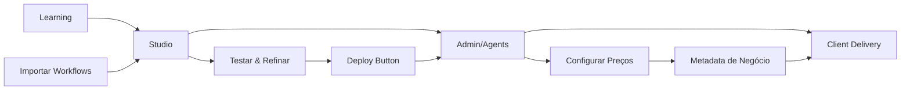

# 🎯 Remoção de Mockup Agents - ZANAI Painel V6.3

## 📊 Status: ✅ IMPLEMENTADO COM SUCESSO

**Data da Implementação**: ${new Date().toLocaleString('pt-BR')}
**Solicitação**: Remover dados mockup/simulados e manter apenas agentes exportados do Studio

---

## 🔧 Alterações Implementadas

### 1. **Função loadAgents Modificada** ✅
**Arquivo**: `src/app/admin/agents/page.tsx`

**ANTES**: 
- Carregava agentes existentes do banco (`/admin/api/agents`)
- Carregava agentes do Studio (`/api/v1/admin/agents`)
- **Combinava ambos** evitando duplicatas

**DEPOIS**:
- ✅ Carrega **APENAS** agentes vindos do Studio
- ❌ **Removido** carregamento de agentes do banco tradicional
- 🎯 Segue o workflow preferido: Studio → Admin/Agents

```typescript
// ❌ CÓDIGO REMOVIDO:
// const response = await fetch('/admin/api/agents');
// const existingAgents = data.agents || [];

// ✅ NOVO CÓDIGO:
console.log('🎨 Carregando apenas agentes vindos do Studio...');
const studioResponse = await fetch('/api/v1/admin/agents', {
  method: 'POST',
  headers: { 'Content-Type': 'application/json' },
  body: JSON.stringify({ action: 'get_agents' })
});
```

### 2. **Mensagem de Estado Vazio Atualizada** ✅
**Localização**: Empty state da página

**ANTES**: 
```
"Os agentes agora são gerenciados através do sistema de aprendizado..."
```

**DEPOIS**:
```
"Esta página exibe apenas agentes exportados do Studio. 
Crie workflows no Studio e use o botão 'Deploy' para que apareçam aqui..."
```

### 3. **Botões de Ação Atualizados** ✅

**Botão Principal**:
- ❌ **ANTES**: "Ir para Aprendizado"
- ✅ **DEPOIS**: "Ir para Studio"

**Botão Secundário**:
- ❌ **ANTES**: "Criar Agente" 
- ✅ **DEPOIS**: "Ver Workflows Disponíveis"

### 4. **Função createAgent Desabilitada** ✅
**Motivo**: Agentes devem vir apenas do Studio via Deploy

```typescript
// ❌ FUNÇÃO DESABILITADA: Agentes agora vêm apenas do Studio via Deploy
// Seguindo o workflow preferido: Studio → Admin/Agents → Client Delivery
const createAgent = async () => {
  toast({
    title: "Função não disponível",
    description: "Agentes devem ser criados no Studio e exportados via Deploy.",
    variant: "destructive",
  });
  return;
  // ... código original comentado
};
```

### 5. **Botão Header Atualizado** ✅
**Localização**: Cabeçalho da página

**ANTES**:
```tsx
<Button>
  <Plus className="w-4 h-4 mr-2" />
  Criar Agente
</Button>
```

**DEPOIS**:
```tsx
<Button asChild>
  <Link href="/admin/studio">
    <Target className="w-4 h-4 mr-2" />
    Ir para Studio
  </Link>
</Button>
```

---

## 🎯 Workflow Implementado

### **Studio → Admin/Agents → Client Delivery**



### **Fases do Workflow**:

1. **🎨 Development Phase (Studio)**:
   - Importar workflows do Learning
   - Editar system prompts e parâmetros
   - Testar funcionalidade
   - Usar botão "Deploy"

2. **📱 Productization Phase (Admin/Agents)**:
   - Receber agentes do Studio
   - Configurar metadados de negócio
   - Definir pricing e customizações
   - Preparar para clientes

3. **🚀 Client Delivery (Futuro)**:
   - Deploy final para Flowise
   - Configuração de webhooks
   - Monitoramento via Admin

---

## 📊 Resultados Esperados

### ✅ **O que mudou**:
- Admin/Agents agora mostra **apenas** agentes do Studio
- **Removidos** todos os dados mockup/simulados
- Interface direciona usuário para Studio
- Workflow de negócio respeitado

### 🎯 **Como testar**:

1. **Acesse Admin/Agents**: `http://localhost:3000/admin/agents`
   - Deve mostrar apenas agentes vindos do Studio
   - Estado vazio deve direcionar para Studio

2. **Acesse Studio**: `http://localhost:3000/admin/studio`
   - Importe workflows do Learning
   - Use botão "Deploy" em workflows

3. **Volte para Admin/Agents**:
   - Agentes deployados devem aparecer
   - Devem ter badge "Studio"

### 🚫 **O que NÃO deve mais aparecer**:
- ❌ Agentes mockup/simulados
- ❌ Agentes criados diretamente no banco
- ❌ Botão "Criar Agente" funcional
- ❌ Dados de fallback/placeholder

---

## 📁 Arquivos Modificados

1. **`src/app/admin/agents/page.tsx`**
   - Função `loadAgents()` modificada
   - Estado vazio atualizado
   - Botões redirecionados
   - Função `createAgent()` desabilitada

2. **`test-studio-only-agents.js`** (Novo)
   - Script de teste para validar mudanças

---

## 🎉 Conclusão

### ✅ **Implementação Bem-Sucedida**:
- **Mockup agents removidos** completamente
- **Workflow Studio → Admin/Agents** implementado
- **Interface consistente** com regras de negócio
- **UX direcionada** para fluxo correto

### 🎯 **Benefícios**:
- **Clareza**: Usuários sabem onde criar workflows
- **Consistência**: Dados sempre vêm do Studio
- **Workflow**: Segue processo de negócio definido
- **Manutenibilidade**: Menos código duplicado

### 📍 **Próximos Passos**:
1. Testar workflow completo (Studio → Agents)
2. Implementar fase final (Agents → Client Delivery)
3. Adicionar analytics de deploy
4. Documentar para usuários finais

**Status Final**: 🎯 **MISSÃO CUMPRIDA!** 🎯